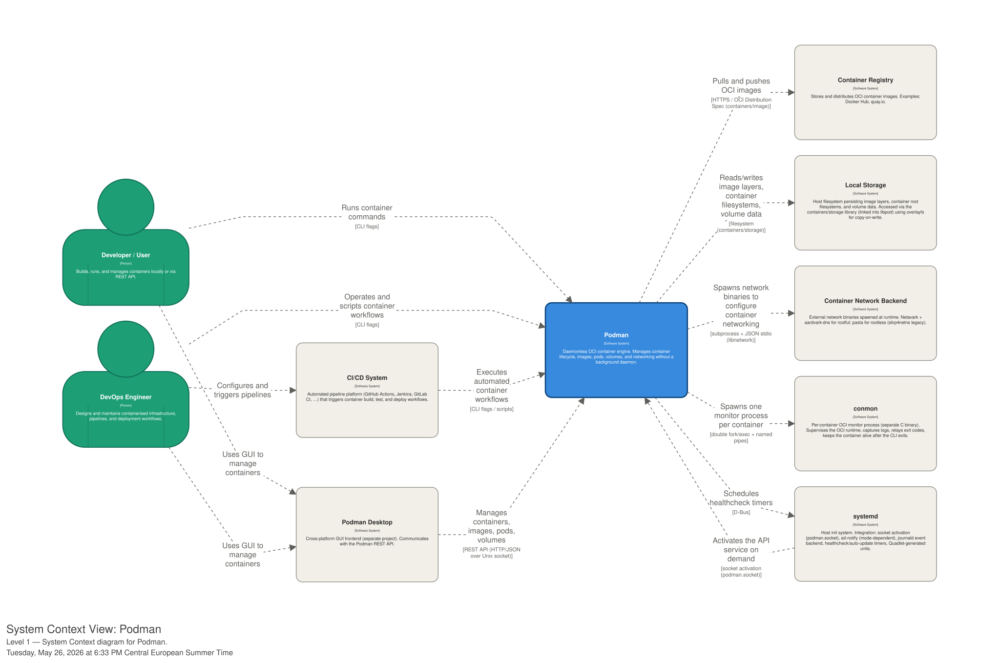
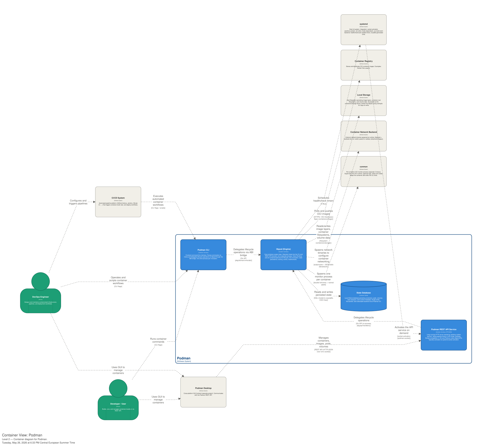
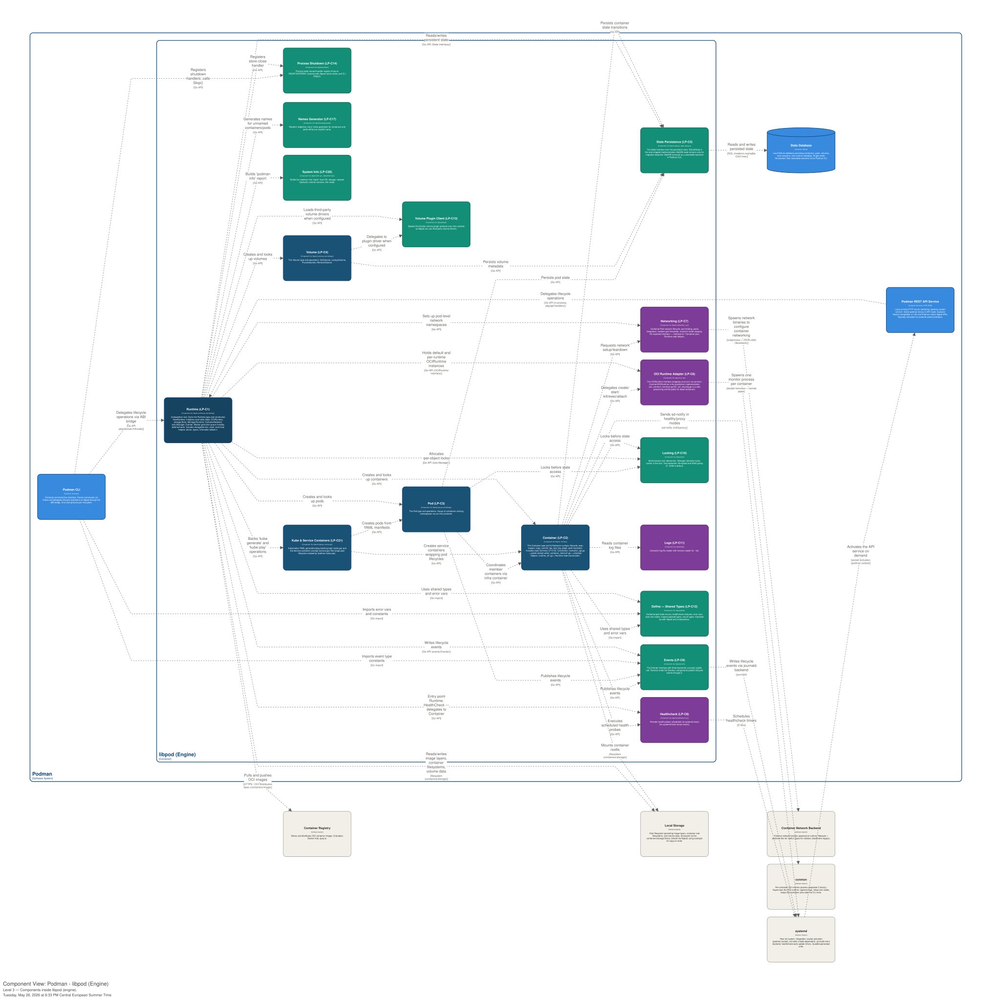
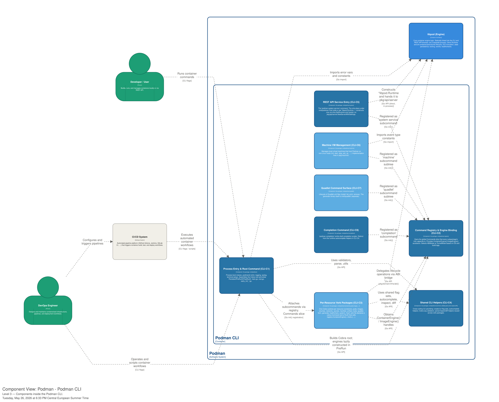

# Podman Software Architecture

## Context Level

### Context diagram

### System Boundary

The core principle of this diagram lies in the sharp separation between Podman's core engine and its supporting ecosystem. Specifically, the **System Boundary** has been defined according to this strict criterion:

- **System (inside it):** includes exclusively the source code hosted and compiled within the `containers/podman` repository (the CLI, the REST API service, and the _Libpod_ library that contains the core business logic).
- **External Ecosystem (outside the System):** includes all runtimes (used to create and manage the containers), network backends, and several software utilities provided by external or third-party repositories. Therefore, even though they are indispensable for execution, they remain external entities that communicate with Podman through logical interfaces or commands.

This clear separation highlights Podman's **daemonless** architecture. Unlike Docker, Podman does not maintain a centralized, always-on background process: instead, it acts as an ephemeral orchestrator that activates upon user command, delegates the ongoing execution and monitoring to specialized utilities (such as `conmon`), and then terminates its own execution.

### Actors' Interactions

Interaction with Podman does not occur through a persistent daemon, but rather through direct invocations of its binary:

- **Developer / User:** sends commands to manage containers via the **local CLI** or makes calls to services and graphical interfaces (such as Podman Desktop) through the **native REST API**.
- **DevOps / CI/CD System:** engineers configure automated pipelines that directly invoke the Podman binary to start test, build, and deployment workflows.

### Ecosystem Interaction

When a command is issued or a workflow is executed, Podman activates and coordinates the various external components of the ecosystem:

- **Image Management, Registries, and Local Storage:** for image handling, the system communicates with external **Container Registries** to *pull* and *push* OCI images. Podman also interfaces directly with **Local Storage** to read and write image layers, container filesystems, and volume data.
- **User Interfaces and CI/CD Systems:** interaction with the engine occurs at multiple levels. Users and developers run direct container commands via CLI, while DevOps engineers configure and trigger pipelines through **CI/CD Systems** to execute automated container workflows. Alternatively, the management of containers, images, pods, and volumes can be handled via **Podman Desktop**, a cross-platform GUI that communicates with the engine using a REST API.
- **Container Lifecycle (conmon and systemd):** upon starting a container, Podman spawns a single external monitor process per container called `conmon`. This component supervises the OCI runtime, captures logs, tracks exit codes, and keeps the container alive after the CLI exits. In parallel, Podman integrates with **systemd** to schedule healthcheck timers and to activate the API service on-demand via socket activation.
- **Networking (Container Network Backend):** Podman does not directly manage the network. Instead, it spawns dedicated network binaries to configure container networking, delegating these operations to the **Container Network Backend** by communicating via subprocesses using JSON over stdin/stdout.

## Container Level

### General Architecture

Taking a deeper look into the C4 container level, we can describe Podman as a software deployed as a monolith depending from modular (and swappable) external systems. Some examples are the init system of the host operating system: while the primary target of Podman is systemd, compatibility is available for alternatives such as rcNG (shipped with freeBSD) and OpenRC (systemd replacement for Linux based OSes). Other examples include OCI runtimes and image manipulation tools.

### Entry Points

The container named **Podman CLI + libpod** is the core component of the system. The CLI is the primary user interface and it embeds the **libpod** library to manage the lifecycle of containers, pods, images, and volumes.

An alternative interaction is provided by the **REST API Service**: in order to maintain compatibility with tools designed for Docker, Podman provides a Docker-like REST API. Through this API, users can also issue standard Podman commands. Similar to the local CLI, this service sits in front of libpod, translating HTTP REST requests into libpod operations over a Unix domain socket. This container is entirely optional and it's possible to avoid its deployment while deploying Podman itself.

### Adherence to the Clean Architecture Blueprint

Podman’s architecture follows the Clean Architecture blueprint through its separation of high-level policy from low-level details. Within the system boundary, **libpod** serves as the stable policy core containing the system’s logic, while external systems like **Netavark** (networking) and **OCI runtimes** (execution) are treated as volatile implementations, belonging to the outermost layer. This structure adheres to the dependency rule, as **libpod** depends on the an abstraction (the OCI specification) rather than a concrete implementation, ensuring source code dependencies point only inward toward stable policies.

Moreover, the **Podman CLI** and the **REST API Service** function as **Adapters**, shaping external requests into a format **libpod** can process while keeping that core independent of the delivery mechanism.

Finally, to improve testability of the system, the **Humble Objects** ([ref1](https://martinfowler.com/bliki/HumbleObject.html), [ref2](https://maxim-gorin.medium.com/cleaner-code-better-tests-leveraging-humble-objects-for-better-architecture-134d30d70b2f)) architectural usage is evident in the delegation of hard-to-test execution tasks to specialized utilities like `conmon` and the various compatible **OCI runtimes**. Those act as the humble objects, as they handle the hard-to-test OS-level execution tasks. **Libpod** instead is treated as the stable and testable core.

## Component Level

Since Podman is a very large OS project we decided to analyze only the component level of the main Containers: Libpod and Podman CLI.
For the component diagrams we have classified the components by color, in order to group them by the same architectural responsibility.

### Libpod

#### Component diagram of Libpod

#### Component types

*   **Green (`libpod_infra`)**: Represents the infrastructure layer. It manages low-level technological details, interfacing with the Linux operating system (cgroups, namespaces), file systems, and data persistence.
*   **Blue (`libpod_domain`)**: Represents the logical heart of the application (the domain). It contains the fundamental business rules, data models (Container, Pod, Volume), and the logic that defines the container lifecycle itself, regardless of how they are executed or externally displayed.
*   **Purple (`libpod_execution`)**: Represents the execution engine and low-level runtime layer (e.g., OCI runtimes like runc or crun). It isolates the invocation logic of the external binaries required to start, monitor, and stop isolated container processes.

#### Domain Components (**`libpod_domain`** - Blue)

- **Runtime (LP-C1):** Acts as the central orchestrator and entry point for the Libpod engine, loading global system configurations and initializing top-level engine behaviors.
- **Volume (LP-C4):** Manages the logical lifecycle, lifecycle policies, and structural configurations of persistent block and file storage volumes decoupled from individual container lifecycles.
- **Pod (LP-C3):** Groups and aggregates individual container entities into a unified pool, managing shared runtime states and resource namespace inheritances.
- **Kube & Service Containers (LP-C21):** Handles the high-level orchestration workflows required to parse, generate, and execute local pod infrastructures using standard Kubernetes-compatible YAML manifests.
- **Container (LP-C2):** Houses the core business logic, strict lifecycle state machines, and configuration templates that model an isolated workload runtime.

#### Libpod Infrastructure Components (`libpod_infra` - Green)

- **Events (LP-C9):** Emits, formats, and pipes structured auditing logs capturing real-time resource state modifications out to system telemetry services like journald.
- **Define Shared Types (LP-C12):** Establishes the static structures, base primitive schemas, and globally uniform type definitions utilized across the distinct architectural engine layers.
- **Locking (LP-C10):** Prevents operational corruption by providing cross-process resource lock synchronization primitives and atomic mutual exclusion controls across memory boundaries.
- **Process Shutdown (LP-C14):** Orchestrates the systemic cleanup steps, signal propagations, and resource freeing routines required during controlled engine terminations.
- **Names Generator (LP-C17):** Delivers a standardized entropy service for compiling unique, deterministic identifier slugs and randomly generated text strings for unnamed container assets.
- **System Info (LP-C20):** Scrapes real-time system metrics, kernel resource capacities, architectural variants, and storage constraints directly from the local machine host.
- **Volume Plugin Client (LP-C13):** Manages the communication socket and external driver proxy interface used to extend storage configurations with third-party vendor utilities.
- **State Persistence (LP-C5):** Materializes logical model schemas into flat relational payloads for physical serialization and storage transactions inside an embedded BoltDB instance.

#### Libpod Execution Components (**`libpod_execution` - Purple**)

- **Healthcheck (LP-C8):** Executes configured evaluation binaries and validation loops directly inside target work namespaces to monitor live workload service health states.
- **Logs (LP-C11):** Establishes safe multi-stream capture pipelines to dynamically multiplex, extract, and buffer low-level stdout, stdin, and stderr channels from isolated running processes.
- **OCI Runtime Adapter (LP-C6):** Translates high-level engine behaviors into raw execution instructions required to command underlying binary runtimes like runc or crun.
- **Networking (LP-C7):** Drives the low-level virtual interface attachments, root bridge setups, IPAM allocation workflows, and firewall routing steps via system adapters.

### Podman CLI 

#### Component diagram of Podman CLI

#### Component types

*   **Blue (`cli_verbs`)**: Represents the command execution layer. It contains the specific CLI verbs, commands, and subcommands (such as entry points, VM management, system services, and completion definitions) that the user directly invokes to interact with the engine.
*   **Light Blue (`cli_infra`)**: Represents the core infrastructure layer of the CLI. It handles foundational utilities, routing, registry systems, helper functions, and the shared logic required to translate text commands into concrete actions for the underlying Libpod engine.

#### Command Execution Components (`cli_verbs` - Blue)

- **Process Entry & Root Command (CLI-C1):** Serves as the primary entry point for the entire command-line interface. It captures the initial raw arguments from the user terminal, handles global flag parsing, and orchestrates the application startup sequences.
- **Completion Command (CLI-C8):** Generates active shell autocomplete configurations and contextual tab-completion logic for modern command-line environments like Bash, Zsh, and Fish.
- **REST API Service Entry (CLI-C5):** Operates as the access point for managing the system's background REST communication, enabling the initialization of local service listeners or relaying actions forward to a remote server endpoint.
- **Command Registry & Engine Binding (CLI-C2):** Houses the primary database table of active verbs, dynamically linking the user-facing command strings to their respective logical execution handlers.
- **Shared CLI Helpers (CLI-C4):** Provides cross-cutting utility functions shared across multiple commands, including shared flag definitions, log initializers, and data printer routines.

#### CLI Infrastructure Components (`cli_infra` - Light Blue)

- **Per-Resource Verb Packages (CLI-C3):** Modular packages that isolate the technical implementation details and sub-commands of specific system assets like images, pods, or containers.
- **Quadlet Command Surface (CLI-C7):** Processes input manifests and drives the integrated generator engine to translate descriptive target configurations directly into production-ready system control objects.
- **Machine VM Management (CLI-C6):** Wraps hypervisor abstraction controls and orchestrates the creation, startup, modification, and teardown of local virtual machine execution environments.

### SOLID Principles Analysis (Level 3)

Several architectural violations of the SOLID principles can be observed at the component level (Level 3) for both Libpod and Podman CLI:

1. **Single Responsibility Principle (SRP) - Violated:**
   - **`Container (LP-C2)`** and **`Runtime (LP-C1)`** act as architectural "God Objects". Instead of strictly encapsulating core domain state machine models, `Container (LP-C2)` handles low-level infrastructural coordination, signaling direct commands to `Locking (LP-C10)` and interacting directly with `Logs (LP-C11)`. Any major change in how system logging streams operate or how memory locks are handled should not force a rebuild of the foundational domain entity blocks.
   - On the client side, **`Process Entry & Root Command (CLI-C1)`** handles CLI initialization, arguments routing, configuration parsing, and system bootstrap management simultaneously, violating the boundary of a single reason to change.

2. **Dependency Inversion Principle (DIP) - Violated:**
   - High-level domain logic components (`libpod_domain` - Blue) should exclusively depend on abstractions (interfaces) rather than low-level concrete implementations. 
   - In the provided layout, **`Runtime (LP-C1)`** and **`Container (LP-C2)`** depend directly and rigidly on the concrete implementations of **`State Persistence (LP-C5)`** and **`Locking (LP-C10)`**. This tight coupling makes testing the internal business state configurations in pure isolation impossible without binding real-world file system locking structures and embedded physical databases.

3. **Interface Segregation Principle (ISP) - Partially Violated:**
   - Downstream infrastructure components and external client modules inherit or directly interact with the giant monolithic schemas of the `Container (LP-C2)` model. 
   - Instead of breaking interactions down into small, highly specialized contracts (such as an independent `Runnable` interface for execution engines or a `Lockable` structure for synchronization systems), modules depend on massive schemas packed with fields they do not require.

## Tooling

- PlantUML: initial tool for C4 diagramming
- Structurizr: current tool for C4 diagramming
