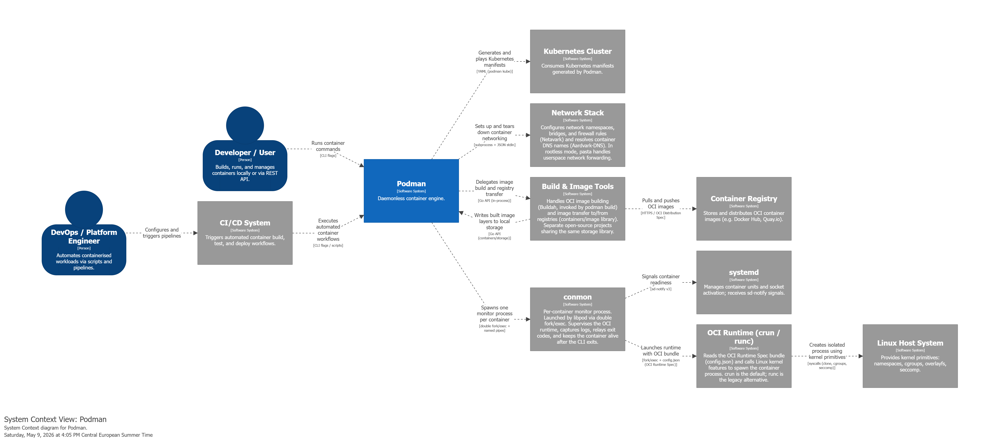
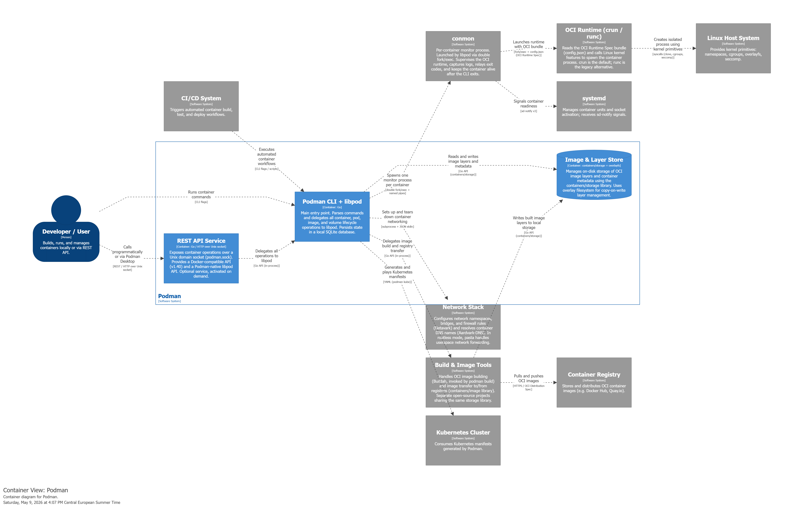

# Podman’s Architecture

## Context Level

### Context diagram

### System Boundary

The core principle of this diagram lies in the sharp separation between Podman's core engine and its supporting ecosystem. Specifically, the **System Boundary** has been defined according to this strict criterion:

- **System (inside it):** includes exclusively the source code hosted and compiled within the `containers/podman` repository (the CLI, the REST API service, and the _Libpod_ library that contains the core business logic).
- **External Ecosystem (outside the System):** includes all runtimes (used to create and manage the containers), network backends, and several software utilities provided by external or third-party repositories. Therefore, even though they are indispensable for execution, they remain external entities that communicate with Podman through logical interfaces or commands.

This clear separation highlights Podman's **daemonless** architecture. Unlike Docker, Podman does not maintain a centralized, always-on background process: instead, it acts as an ephemeral orchestrator that activates upon user command, delegates the ongoing execution and monitoring to specialized utilities (such as `conmon`), and then terminates its own execution.

### Actors' Interactions

Interaction with Podman does not occur through a persistent daemon, but rather through direct invocations of its binary:

- **Developer / User:** sends commands to manage containers via the **local CLI** or makes calls to services and graphical interfaces (such as Podman Desktop) through the **native REST API**.
- **DevOps / CI/CD System:** engineers configure automated pipelines that directly invoke the Podman binary to start test, build, and deployment workflows.

### Ecosystem Interaction

When a command is issued, Podman activates and coordinates the various external components of the ecosystem:

- **Image management and Registries:** for building (`podman build`), the system interfaces with external **Buildah** APIs and shared _containers/image_ libraries. It then communicates with external **Container Registries** (e.g., docker.io and quay.io registries) to _pull_ and _push_ OCI images. Podman also has the native capability to generate manifests for **Kubernetes** clusters.
- **Container Lifecycle (conmon and OCI Runtime):** upon starting a container, Podman performs a double fork and instantiates an external monitoring process called `conmon`. It is then `conmon` itself that launches the OCI Runtime (`crun` / `runc`), passing it the configuration package (OCI bundle). Once the container has started, Podman shuts down, while `conmon` remains active in the background to monitor the process and communicate its status to `systemd` (which acts as the native supervisor of the Linux Host by managing the automatic startup and restart of containers through persistence, cgroups, and system logging).
- **Networking and Security (Network Stack):** Podman doesn't directly manage networking. It delegates the creation of bridges and firewall rules to **Netavark**. In _rootless_ mode (without root privileges), it leverages external tools like **pasta** to forward traffic securely.
- **Linux Host System:** the OCI Runtime translates the received commands into direct calls to native Linux kernel primitives (such as _Namespaces, Cgroups_, and _Seccomp_) to physically isolate the processes on the host system.

## Container Level

### General Architecture

Taking a deeper look into the C4 container level, we can describe Podman as a software deployed as a monolith depending from modular (and swappable) external systems. Some examples are the init system of the host operating system: while the primary target of Podman is systemd, compatibility is available for alternatives such as rcNG (shipped with freeBSD) and OpenRC (systemd replacement for Linux based OSes). Other examples include OCI runtimes and image manipulation tools.

### Entry Points

The container named **Podman CLI + libpod** is the core component of the system. The CLI is the primary user interface and it embeds the **libpod** library to manage the lifecycle of containers, pods, images, and volumes.

An alternative interaction is provided by the **REST API Service**: in order to maintain compatibility with tools designed for Docker, Podman provides a Docker-like REST API. Through this API, users can also issue standard Podman commands. Similar to the local CLI, this service sits in front of libpod, translating HTTP REST requests into libpod operations over a Unix domain socket. This container is entirely optional and it's possible to avoid its deployment while deploying Podman itself.

### Adherence to the Clean Architecture Blueprint

Podman’s architecture follows the Clean Architecture blueprint through its separation of high-level policy from low-level details. Within the system boundary, **libpod** serves as the stable policy core containing the system’s logic, while external systems like **Netavark** (networking) and **OCI runtimes** (execution) are treated as volatile implementations, belonging to the outermost layer. This structure adheres to the dependency rule, as **libpod** depends on the an abstraction (the OCI specification) rather than a concrete implementation, ensuring source code dependencies point only inward toward stable policies.

Moreover, the **Podman CLI** and the **REST API Service** function as **Adapters**, shaping external requests into a format **libpod** can process while keeping that core independent of the delivery mechanism.

Finally, to improve testability of the system, the **Humble Objects** ([ref1](https://martinfowler.com/bliki/HumbleObject.html), [ref2](https://maxim-gorin.medium.com/cleaner-code-better-tests-leveraging-humble-objects-for-better-architecture-134d30d70b2f)) architectural usage is evident in the delegation of hard-to-test execution tasks to specialized utilities like `conmon` and the various compatible **OCI runtimes**. Those act as the humble objects, as they handle the hard-to-test OS-level execution tasks. **Libpod** instead is treated as the stable and testable core.

### SOLID Principles

Podman’s container structure reveals some SOLID principles surfacing at C4's second level, namely the Single Responsibility Principle (SRP), Dependency Inversion Principle (DIP) and Common Closure Principle (CCP).

Regarding the SRP, Podman delegates specialized tasks—such as networking to `Netavark` and monitoring to `conmon`, both external systems, creating architectural boundaries that prevent the propagation of changes to the core **libpod** logic. The core stability is reinforced by the DIP: **libpod** depends on the OCI Specification rather than a concrete implementations like `runc` or `crun`. Finally, the separation between the local **Podman CLI** and the **REST API Service** follows the CCP, dividing Podman-native entry points and compatibility entry points.
