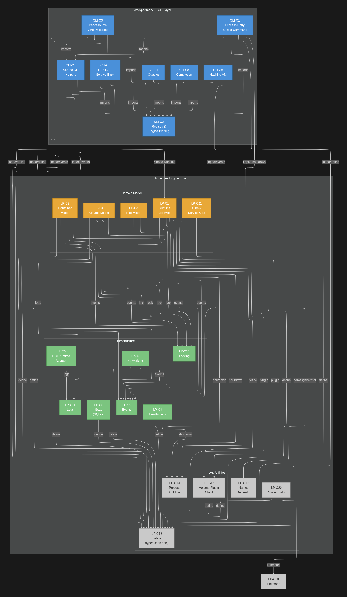
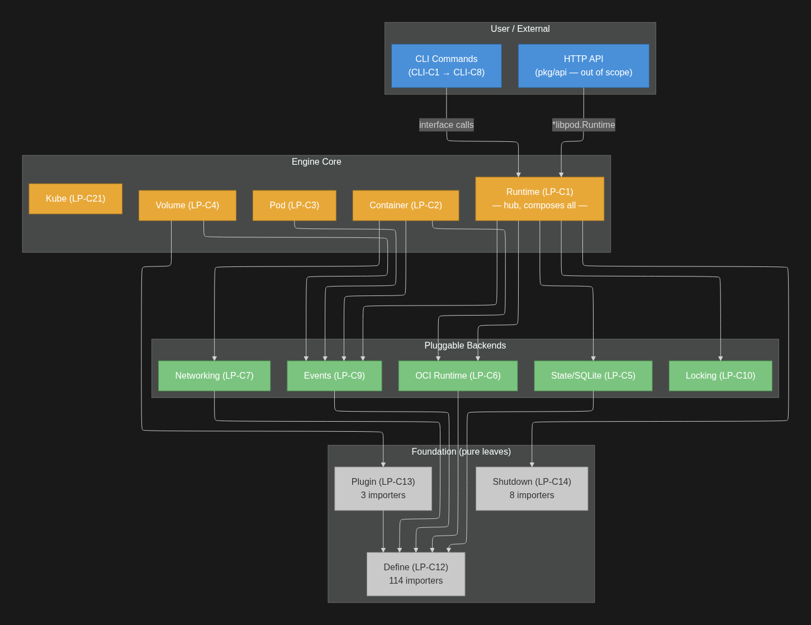
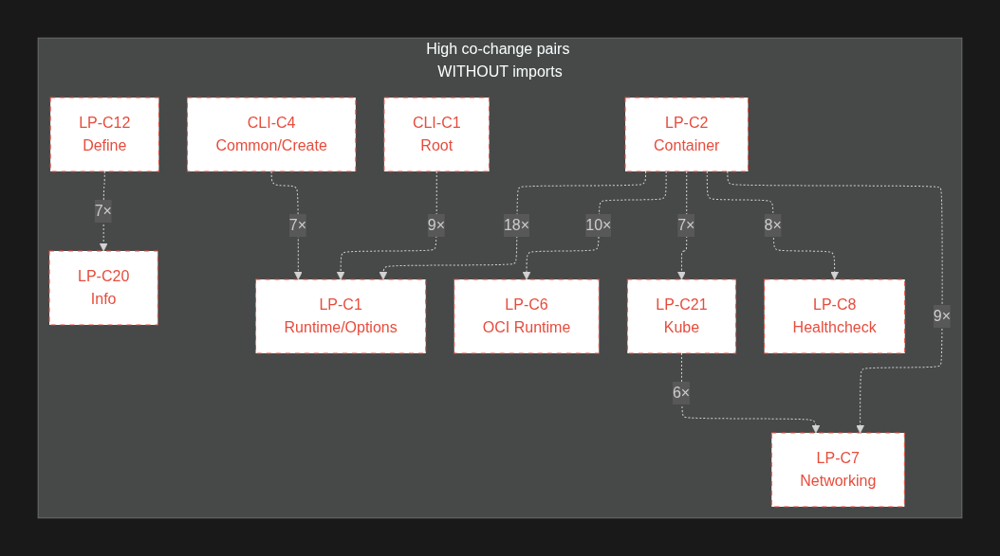

# Podman Software Design

## Code Dependencies

### Methodology

Code dependencies were extracted through static analysis of Go `import` statements across all files in `cmd/podman/` (CLI-C1 through CLI-C8) and `libpod/` (LP-C1 through LP-C21). Each import was classified into three buckets: in-scope (imports between analyzed components), out-of-scope repository (imports from other Podman packages such as `pkg/`), and external (third-party libraries and Go standard library). This classification enables reasoning about which coupling is architecturally deliberate versus incidental.

### Dependency Graph Structure

The full dependency graph is organized into four color-coded tiers that enforce a strict downward-only dependency direction. Blue nodes represent the CLI layer (CLI-C1 through CLI-C8), forming the user-facing command surface. Orange nodes represent the Domain Model (LP-C1 through LP-C4, LP-C21), containing business objects that encapsulate container, pod, and volume lifecycle logic. Green nodes represent the Infrastructure tier (LP-C5 through LP-C11), providing pluggable backend services. Grey nodes represent the Foundation tier (LP-C12 through LP-C20), consisting of pure leaf packages with zero in-scope upstream dependencies.

The CLI layer accesses the engine exclusively through lightweight leaf packages: LP-C12 (Define) for error constants and state enums, LP-C9 (Events) for event type definitions, and LP-C14 (Shutdown) for signal handling. CLI components never import the core domain models directly; this boundary is maintained through the out-of-scope `pkg/domain/entities` interface layer.

Within the Domain Model tier, LP-C1 (Runtime) acts as the architectural hub, composing all infrastructure components through struct fields. LP-C2 (Container), the largest component at approximately 13,400 lines across 25 files, consumes the widest set of infrastructure services: events, locking, shutdown, and logs. LP-C3 (Pod) and LP-C4 (Volume) follow narrower patterns.

The Infrastructure tier depends downward on Leaf Utilities but never upward on domain models, preserving substitutability. LP-C9 (Events) has zero upstream libpod dependencies, making it self-contained with three interchangeable backends (journald, logfile, null). LP-C12 (Define) is the most imported package in the codebase with 114 importers, serving as the lingua franca of shared types. LP-C14 (Shutdown) demonstrates cross-layer reuse: both CLI-C1 and engine components LP-C1, LP-C2, and LP-C8 import it because signal handling is inherently process-global.

### Highest and Lowest Dependency Files

At the extremes of the dependency spectrum, `container_internal_common.go` within LP-C2 holds 59 imports, reflecting its role as the coordination point for lock state, systemd integration, networking, storage layers, and event emission. Similarly, `container_internal.go` (52 imports) and `runtime.go` (38 imports) serve as major lifecycle hubs within LP-C2 and LP-C1 respectively. In the CLI layer, `root.go` (CLI-C1) reaches 26 imports as it orchestrates engine creation, profiling, error formatting, and signal handling for every Podman invocation.

At the opposite end, `namesgenerator/names-generator.go` (LP-C17) requires only 2 standard library imports, and `completion/completion.go` (CLI-C8) requires only 2 imports total. These minimally-coupled files are intentionally isolated: the names generator is a pure algorithmic utility, while the completion command delegates entirely to Cobra's built-in shell script generators. Similarly, `oci.go` (LP-C6) imports only 4 packages to define the `OCIRuntime` interface, preserving a clean abstraction boundary free of implementation details.

The full dependency graph and the simplified layered view are presented below. The first captures every in-scope import edge with arrows from importer to importee. The second collapses components into their architectural tiers, annotating importer counts to show load distribution.

## Knowledge Dependencies

### Methodology

Knowledge dependencies were extracted from git commit history using `git log --no-merges --since="2023-01-01" --name-only` over a 2.5-year window (January 2023 to June 2026), covering 1,152 commits. Ten bulk commits touching more than 50 files were excluded. A co-change pair was recorded whenever two files appeared in the same commit; only pairs with 5 or more co-occurrences were retained, yielding 151 significant pairs.

### Interpreting the Ghost Arrows

The diagram below shows exclusively those pairs where files co-change frequently despite having no direct Go import between them. The dashed red edges represent "ghost arrows": evolutionary coupling that the compiler cannot enforce and that static import analysis cannot detect. These indicate implicit contracts between components that could break silently if one side is modified without the other.

### Key Findings

The dominant pattern is the LP-C2 to LP-C1 coupling (18 co-changes between `container_internal_common.go` and `options.go`). Every new container feature requires a three-file pipeline: a configuration field in `container_config.go` (LP-C2), a corresponding functional option in `options.go` (LP-C1), and implementation logic in `container_internal_common.go` (LP-C2). The compiler enforces none of these co-modifications; only developer discipline and code review prevent drift between the configuration schema and its consumers.

The LP-C2 to LP-C6 coupling (10 co-changes) reveals the delegation contract between container lifecycle and the OCI runtime adapter. When `container_internal_common.go` changes how it invokes process management, `oci_conmon_common.go` must adapt accordingly. The OCIRuntime interface (52 methods) is the formal contract, but behavioral changes that preserve method signatures still require synchronized updates to both sides.

The cross-layer ghost arrows from CLI-C1 and CLI-C4 to LP-C1 (9 and 7 co-changes respectively) expose the "full-stack feature" pattern: adding a new CLI flag in `root.go` or `common/create.go` necessitates a corresponding runtime option in `options.go`. This coupling spans the entire architectural stack from CLI surface to engine configuration, representing the longest co-change chain in the system.

LP-C21 (Kube) provides an instructive case. It has no import relationship with LP-C2 or LP-C7, yet co-changes 7 and 6 times with them respectively. This occurs because `kube.go` translates container and network state into Kubernetes YAML representations; every field addition to a container or network configuration must be mirrored in the kube translation layer. This "translation layer" coupling is a known maintenance burden in systems that maintain multiple serialization formats of the same domain model.

The LP-C12 to LP-C20 coupling (7 co-changes) represents shared schema evolution: `define/info.go` declares the system information struct types that `info.go` (LP-C20) populates. When new system attributes are exposed, both the type definition and its population logic must change together, despite residing in separate packages with no bidirectional import.

Finally, the CLI-C6 (Machine) subsystem contains the densest intra-component co-change cluster in the entire codebase: 63 of the 151 significant pairs (42%) involve machine files, with pairs such as `init.go`/`set.go` reaching 11 co-changes. This density reflects the heavy API stabilization refactoring during the Podman 5.0 development cycle, where the machine subsystem's interface underwent rapid iteration that forced synchronized modifications across all verb files.

### Architectural Implications

The knowledge dependency analysis reveals that Podman's actual coupling topology is substantially denser than what the code dependency graph alone suggests. The ghost arrows identify three primary risk categories: feature pipelines spanning multiple components without compiler enforcement (LP-C2/LP-C1), delegation contracts where behavioral changes propagate without signature changes (LP-C2/LP-C6), and translation layers that must mirror upstream domain evolution (LP-C21/LP-C2/LP-C7). Automated co-change detection tooling or architectural fitness functions would help catch such drift before it manifests as runtime failures.

## Design Patterns

We choose to present here 5 patterns, each one found by a different member of the group:

### Command Pattern

Roles:
* *Command:* `cobra.Command` struct with a `RunE` handler.
* *Concrete Command:* Verb files (e.g., `completion.go`, `run.go`, `init.go`).
* *Invoker:* Cobra's `Execute()` dispatcher.
* *Receiver:* `registry.ContainerEngine()`.

This pattern solves the architectural challenge of decoupling CLI parsing from command execution. By treating commands as objects, it allows the Cobra framework to uniformly generate --help menus, shell completions, and manage hierarchical subcommands without relying on massive, unmaintainable switch-case statements. As an alternative, developers could implement a direct function dispatch table (e.g., a map[string]func). While this approach would be simpler and completely remove the dependency on a third-party framework, it ultimately loses built-in help generation, advanced flag parsing, and the ability to easily nest commands.

### Adapter Pattern

Roles:
* *Abstraction Interface:* `OCIRuntime`.
* *Adapters:* `ConmonOCIRuntime`, `oci_missing`.

The adapter pattern is used to separate the high-level container lifecycle state from the low-level execution mechanics of OCI runtimes like crun or runc. An alternative implementation would involve hardcoding system commands directly to crun within the lifecycle methods. Although a hardcoded approach eliminates the overhead and indirection introduced by the adapter interface, it strictly violates the Open/Closed Principle and prevents the system from seamlessly plugging in alternative virtual machine runtimes, such as Kata Containers, or gracefully handling missing runtimes during state recovery.

### Factory Pattern

Roles:
* *Factory:* `namesgenerator/names-generator.go`.
* *Client:* `runtime.go` / `options.go`.

By encapsulating the randomized, dictionary-based name generation algorithm, this pattern keeps the core runtime engine completely unaware of the underlying word dictionaries when users fail to explicitly provide a container name. If this were instead implemented via inline generation directly within the container creation routines, it would marginally reduce the project's package and directory overhead. However, this inline alternative would break the Single Responsibility Principle, reduce code reusability across other resources, and significantly hinder the independent unit testing of the naming dictionaries.

### Singleton Pattern

Roles:
* *Singleton Instance:* Package-level `containerEngine` variables.
* *Access Point:* `registry.ContainerEngine()`.

The singleton pattern ensures that the heavy and expensive initialization of the container engine occurs exactly once, allowing that single instance to be safely shared across all verb packages during a single CLI invocation. An architectural alternative would be utilizing dependency injection via function parameters. While dependency injection successfully eliminates global state and creates highly testable, explicit code, it would require complex workarounds to thread the initialized engine through Cobra's rigid `RunE` function signatures, which do not natively support custom parameters.

#### Registry

Roles:
- Registry: package-level map `handlers` at `map[string]func(os.Signal) error`.
- Registration: `Register(name, handler)` at `shutdown/handler.go:124-140` - adds a named handler and prepends it to `handlerOrder` (LIFO).
- Deregistration: `Unregister(name)` at `shutdown/handler.go:143-166`.
- Invocation: `Start()` at `shutdown/handler.go:41-90` - listens for SIGINT/SIGTERM, then iterates `handlerOrder` invoking each handler by name from the map.
- Inhibit/Uninhibit: `Inhibit()` / `Uninhibit()` at `:112-119` - RWMutex that temporarily blocks signal handling during critical sections.
- Clients:
  - `runtime.go:206-213` registers the store-close handler.
  - `container_internal.go` / `container_copy_common.go` call `Inhibit()`/`Uninhibit()` during file copies.
  - `healthcheck.go` calls `Inhibit()` during health execs.
  - `cmd/podman/root.go:151` calls `shutdown.Stop()`.

The Registry pattern solves the problem of multiple independent subsystems—such as storage, containers, and health timers, requiring ordered cleanup upon process termination without needing to be directly aware of one another. Because Go's `signal.Notify` overrides previous handlers, a central registry guarantees that all registered cleanups execute reliably in a defined Last-In-First-Out (LIFO) order. Alternatively, the system could rely on a single, hardcoded shutdown function that explicitly calls all cleanup steps in a row. While this would offer explicit visual ordering, eliminate map lookup overhead, and simplify the code structure, it introduces severe architectural drawbacks. It creates tight coupling by forcing every new subsystem to modify the central function, introduces circular import risks, prevents dynamic addition or removal of handlers during operations like container copying, and makes isolated testing extremely difficult since the entire subsystem state must be constructed at once.

## Summary

The architectural analysis of Podman reveals a complex architecture: the codebase isolates pure utilities to achieve low code dependency, while centralizing heavy lifecycle coordination within big modules like `container_internal_common.go` and `root.go`. Moreover, a historical analysis of knowledge dependencies exposes some invisible logical coupling; files with zero direct code imports—such as flag configuration sets and physical storage engines—frequently co-change due to feature-driven updates and interface alignment. To manage this complexity and enforce clean boundaries, Podman systematically leverages core design patterns. It utilizes the Command and Singleton patterns to safely bridge Cobra’s rigid CLI layer with a single, shared container engine instance, relies on Adapter and Factory patterns to isolate low-level OCI runtimes and name-generation dictionaries, and implements a specialized Registry pattern to ensure thread-safe, ordered subsystem cleanup during process termination.

## Tooling

- Goplantuml: automated UML generation from Go source code
- Git: co-changes analysis
